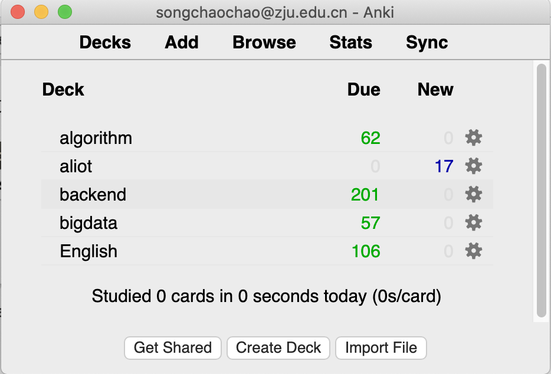
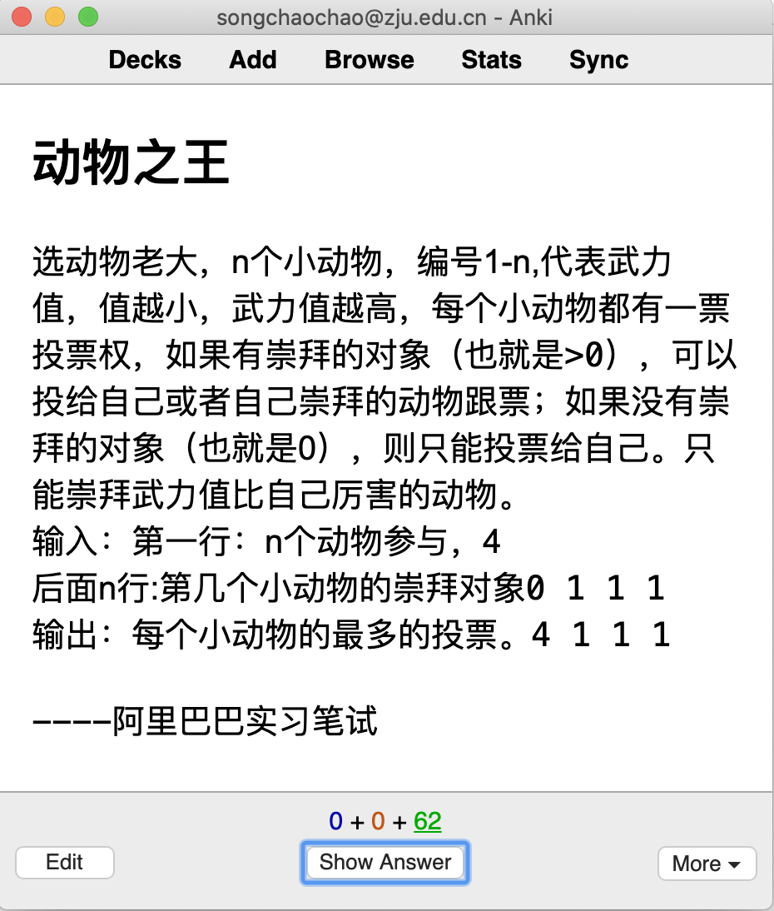
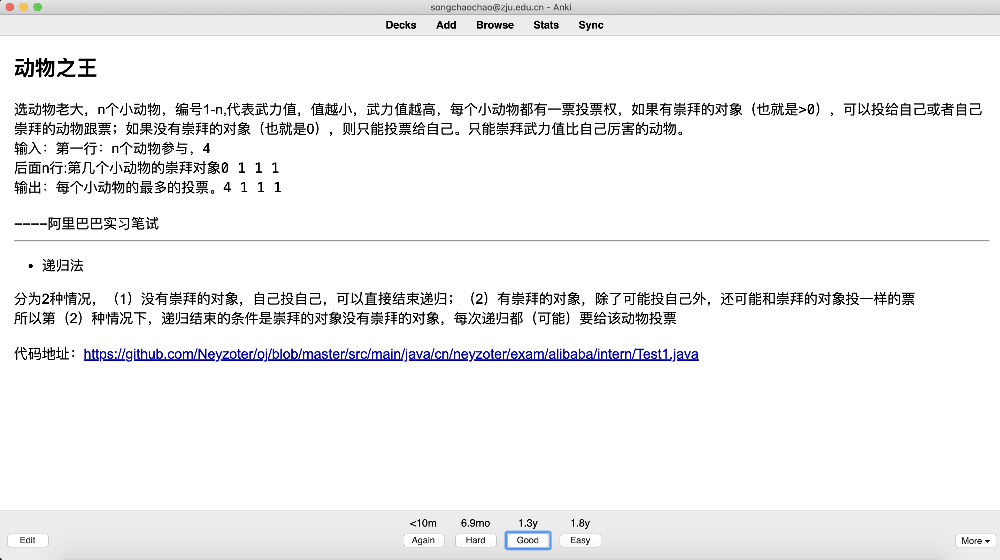

# 项目说明

我的Anki八股文卡片备份。

从2020年8月9日开始停止push到github中，Anki的文件太大了！

但是，还是会定期更新到RELEASE中，可以**到[RELEASE](https://github.com/Neyzoter/Anki-Backup/releases)下载最新的Anki文件**。

# 使用提示

你可以使用[Anki客户端](https://apps.ankiweb.net/)打开文件。

关于Anki的介绍，见我的[博客](https://neyzoter.cn/2020/03/09/Anki-Introduction/)。

卡片中的部分问题和项目有关，比如InfluxDB、MongoDB，并不是校招考察重点。如果自身项目中无相关内容，可以跳过。校招考察重点为Java（如果有时间可以深入看《深入理解Java虚拟机》和《Java并发编程的艺术》，并自行做卡片笔记）、计算机基础（操作系统、计算机网络、计算机组成原理）、数据库（MySql）、算法题。

# 卡片预览

* 卡片目录

  

* 卡片预览

  

  

# 成果

* 2020年秋招

  这些卡片帮助我在2020年秋季校园招聘中收获超过10个Offer，包括阿里巴巴、拼多多、英特尔、滴滴、携程、海康威视、唯品会、蔚来汽车、驭势科技、Oppo、有赞等。

# 联系方式

Email: sonechaochao@gmail.com

公众号：互联网矿工

